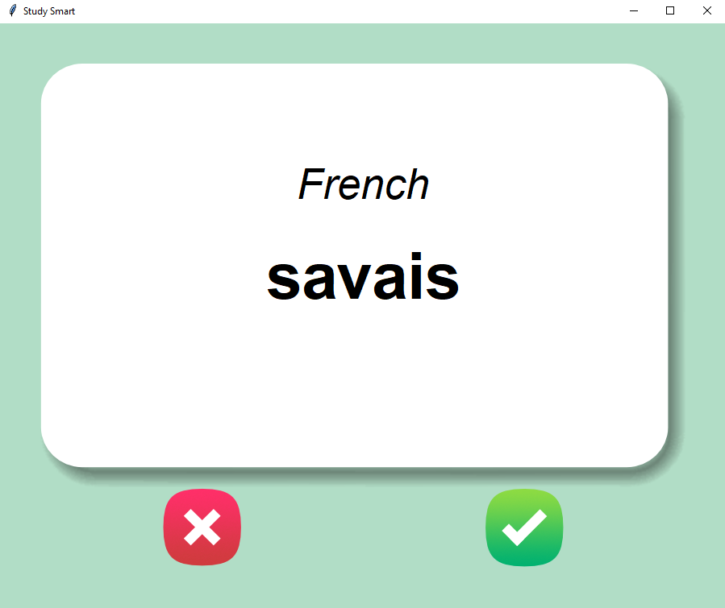

# Flashcard App

Welcome to the Flashcard App! This application is designed to help you learn and remember new words or concepts through the use of flashcards.

## Features
- **Create Flashcards**: Easily create new flashcards with a question and answer.
- **Study Mode**: Flip through flashcards to test your knowledge.
- **Random Selection**: Flashcards are randomly selected for a varied learning experience.
- **Track Progress**: Keep track of which flashcards you've mastered and which ones you need to review.

## Getting Started
1. Clone the repository to your local machine.
2. Install the required dependencies using `pip install -r requirements.txt`.
3. Run the `main.py` file to start the application.

## Usage
- Click on the "Add Flashcard" button to create a new flashcard.
- Click on the "Study Flashcards" button to start studying.
- Use the arrow buttons or keyboard shortcuts to navigate through the flashcards.
- Mark flashcards as mastered or in need of review as you go through them.

## Screenshots

## Contributing
Contributions are welcome! If you have any ideas for improvements or new features, feel free to open an issue or submit a pull request.

## Credits
- Developed by [Supun Wickramarachchi](https://github.com/supunwickramarachchi).
- Inspired by the need for an effective and efficient way to learn new information.

Happy learning with the Flashcard App!
